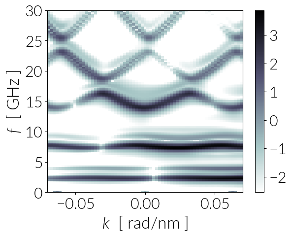

[](https://doi.org/10.5281/zenodo.1193279)

# Chiral Magnonic Crystals: Micromagnetic Simulations

This repository has all the necessary tools to reproduce the micromagnetic
simulations from the publication: **Chiral Magnonic Crystals: Unconventional Spin-Wave
Phenomena Induced by a Periodic Dzyaloshinskii-Moriya Interaction** from *R. A.
Gallardo, D. Cortés-Ortuño, T. Schneider, A. Roldán-Molina, F. Ma, R. E. Troncoso,
K. Lenz, H. Fangohr, J. Lindner and P. Landeros*.

## System

The system under study is a 3000 nm long and 200 nm wide Permalloy stripe with
a periodic DMI, which can be obtained by patterning periodic arrays of heavy
metal wires on top of the sample.

The periodicity in the sample depends on three factors: the periodicity
parameter `a`, the width of the ferromagnetic material `w` and the width `w_D`
of the heavy metal wires, which induce a periodic interfacial DMI.

For example, for a system with `a=100 nm`, if we specify the heavy metal widths
as `w_D=a/2`, we obtain the pattern:


Magnetic parameters of permalloy are:

```
    Ms = 0.658e6    MA/m
    A  = 11.1e-12   J/m
    D  = 3e-3       J/m^2  (this is variable and depends on the
                            induced DMI from the heavy metal wire)
```

## Simulations

We use OOMMF to simulate the magnonic waveguides and follow the methods from
[1] to compute the spin wave dispersion relation.

In our study, we fix the periodicity to a value of `a=100 nm` and we set
different heavy metal widths `w_D` of `a`, `a/2`, `a/4` and `0` (these
parameters can be changed from the OOMMF scripts in `sim` through the
`a` and `w` parameters). The width of the regions in the ferromagnet
without DMI is `w=a - w_D`.

The first step in the simulations is to relax the sample with a strong magnetic
field of `B=0.25 T` to saturate the magnetisation along the `y` direction,
which is along the sample width.

After relaxation, we excite the system using a `sinc` pulse of `0.025 T` of
magnitude with a cutoff frequency of `60 GHz` and centered at `50 ps`. We apply
this excitation in a `4 nm` wide region at the middle of the stripe, as shown
in the first figure. The system dynamics during the excitation process
is saved every `0.5 ps` during `8000` steps, i.e. for `4 ns`.


## Damping

The theory is based on infinitely long and wide stripes. In the simulation we
use a finite width of 200 nm. We set a damping of `0.01` magnitude that
exponentially grows damping towards the width edges as shown in:


By setting the damping in this way, we can obtain clearer images of the
spin wave spectrum of the system by avoiding reflection of the spin
waves at the boundary [2]. In our system, a significant noise comes from the
width edges rather from the edges at the extremes of the long side of
the stripe.

## Spectrum

Using the scripts in the `data_plot` folder we extract the spin components
along the sample length at the middle of the stripe for every time step.
Consequently, we apply a 2D Fourier transform with a `hanning` window function.
To plot the spectrum we use either a `squared` or `log` scale for the power
intensity.

A `log` scaled plot for the spectrum of the system with `w_d=50 nm` is shown
below:




# Docker

If Docker is installed in your system, all the simulations and data processing 
scripts can be run automatically run using

```bash
    make run_all
```

This command builds a Docker container using the `joommf/oommf` image,
runs the simulations in the `sim` folder and generates the data using
the scripts in the `data_plot` folder.

# Extensions

Simulation scripts from this repository are specified with the original OOMMF extension for interfacial DMI. This module works for confined geometries. These simulations can be modified for the analysis of infinite films by using periodic boundaries with the `Oxs_PeriodicRectangularMesh` mesh class and the module provided in this [repository](https://github.com/joommf/oommf-extension-dmi-cnv), wich accepts periodic meshes. Results of systems with an *infinite* width should be equivalent to the figures shown in the paper associated to this Supplementary Material, which were simulated using the MuMax3 software with periodic boundaries along the y-direction of the waveguide.

# Cite

If you want to cite this repository you can refer to this bibtex entry:

```
@Misc{Cortes2018,
  author       = {David Cort{\'e}s-Ortu{\~n}o and Hans Fangohr},
  title        = {Data set for ``Chiral Magnonic Crystals: Unconventional Spin-Wave Phenomena Induced by a Periodic Dzyaloshinskii-Moriya Interaction''},
  howpublished = {Zenodo doi:10.5281/zenodo.1193279. Github: https://github.com/davidcortesortuno/paper-2018-chiral\_magnonics},
  month        = apr,
  year         = {2018},
  doi          = {10.5281/zenodo.1193279},
  url          = {https://doi.org/10.5281/zenodo.1193279},
}

```

# References

[1] Venkat et al. *Proposal for a Standard Micromagnetic Problem: Spin Wave
Dispersion in a Magnonic Waveguide*. IEEE Trans. Magn., 46, 1 (524-529). 2013.

[2] Venkat et al. *Mesh Size and Damped Edge Effects in Micromagnetic Spin Wave
Simulation*. Preprint at arXiv:1405.4615. 2014.
