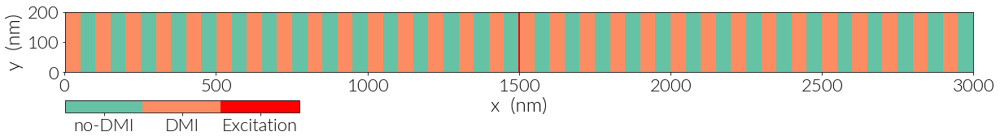
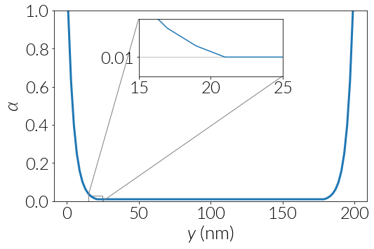

# Chiral Magnonics: Micromagnetic Simulations

This repository has all the necessary tools to reproduce the micromagnetic
simulations from the publication: **Chiral Magnonic Crystals: Breaking the Spin
Wave Symmetry with a Periodic Dzyaloshinskii-Moriya Interaction** from
*R. A. Gallardo, D. Cortes-Ortuno, T. Schneider, A. Roldan-Molina,
Fusheng Ma, J. Lindner, H. Fangohr and P. Landeros*.

## System

The system under study is a 3000 nm long and 200 nm wide Permalloy stripe with
a periodic DMI, which can be obtained by patterning periodic arrays of heavy
metal wires on top of the sample.

The periodicity in the sample depends on three factors: the periodicity
parameter `a`, the width of the ferromagnetic material `w` and the width of the
heavy metal wires `w_D`.

The simulations are specified for the limiting case `a=w` which is a
ferromagnet with periodic heavy metal wires on top, which induce a periodic
interfacial DMI. Accordingly, the system is solely determined by `a` and the
heavy metal widths `w_D`.

For example, for a system with `a=100 nm`, if we specify the heavy metal widths
as `w_D=a/2`, we obtain the pattern:



## Simulations

We use OOMMF to simulate the magnonic waveguides.

In our study, we fix the periodicity to a value of `a=100 nm` and we set
different heavy metal widths `w_D` of `a`, `a/2`, `a/4` and `0` (these
parameters can be changed from the OOMMF scripts in `sim` through the
`a` and `w` parameters).

The first step in the simulations is to relax the sample with a strong magnetic
field of `B=0.25 T` to saturate the magnetisation along the `y` direction,
which is along the sample width.

After relaxation, we excite the system using a `sinc` pulse of `0.025 T` of
magnitude with a cutoff frequency of `60 GHz` and centered at `50 ps`. We apply
this excitation in a `4 nm` wide region at the middle of the stripe, as shown
in the first figure. The system dynamics during the excitation process
is saved every `0.5 ps` during `8000` steps, i.e. for `4 ns`.


## Damping

The theory is based on infinitely long and wide stripes. In the simulation we
use a finite width of 200 nm. We set a damping of `0.01` magnitude that
exponentially grows damping towards the width edges as shown in:



By setting the damping in this way, we can obtain clearer images of the
spin wave spectrum of the system by avoiding reflection of the spin
waves at the boundary. In our system, a significant noise comes from the
width edges rather from the edges at the extremes of the long side of
the stripe.

## Spectrum

Using the scripts in the `data_plot` folder we extract the spin components
along the sample length at the middle of the stripe for every time step.
Consequently, we apply a 2D Fourier transform with a `hanning` window function.
To plot the spectrum we use either a `squared` or `log` scale for the power
intensity.

# Docker

If Docker is installed in your system, all the simulations and data processing 
scripts can be run automatically run using

```bash
    make run_all
```

This command builds a Docker container using the `joommf/oommf` image,
runs the simulations in the `sim` folder and generates the data using
the scripts in the `data_plot` folder.

# Cite

If you want to cite this repository you can do it using this bibtex entry:

```
    Some citation
```

# References

[] Paper

[] Venkat et al., *Mesh Size and Damped Edge Effects in Micromagnetic Spin Wave
Simulation*. Preprint at arXiv:1405.4615 (2014).

[]
